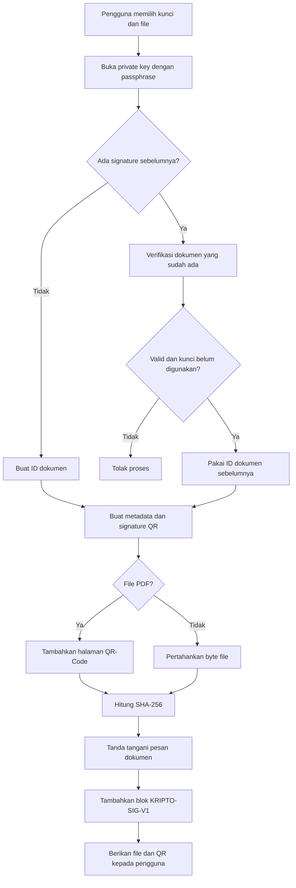
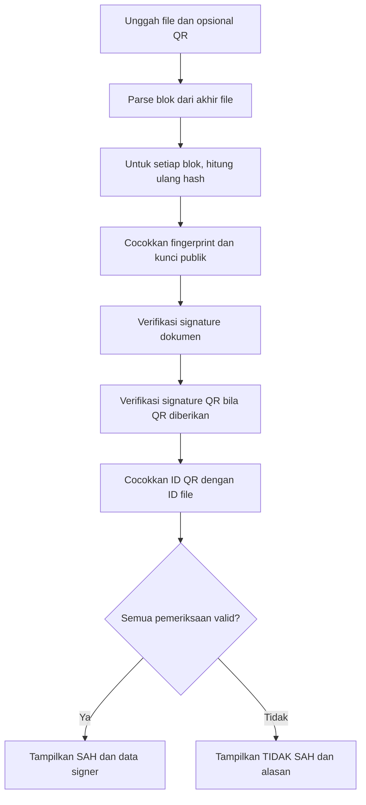

# APLIKASI TANDA TANGAN DIGITAL ECDSA P-256 DENGAN QR-CODE DAN BEBERAPA PENANDATANGAN

**Laporan Proyek Aplikasi Kriptografi dan Keamanan Informasi**  
**Topik D: Aplikasi Digital Signature**

| Keterangan | Isi |
|---|---|
| Nama aplikasi | Kripto Tanda Tangan / Siliwangi-Disign |
| Anggota | Ghea Ragil Aulia — 247006111003 Ristin Iman Andini — 247006111024 |
| Repositori | https://github.com/RistinAndini78/signify-project |
| Video demonstrasi | [DIISI: tautan video YouTube] |
| Berkas pengumpulan | [DIISI: TugasKripto_D_<NPM-Ketua>.pdf] |

> **Catatan penyusunan.** Laporan ini disusun berdasarkan `README.md`, `laporan/laporan.md`, `data-uji/hasil/hasil.json`, grafik pada `laporan/gambar/`, `data-uji/CATATAN.md`, kode sumber, dan dokumentasi penggunaan asisten AI. Angka benchmark yang ditulis di sini mengikuti hasil yang tersimpan pada berkas tersebut. Screenshot antarmuka yang dikirimkan sebagai acuan perlu ditempelkan ke dokumen Word pada lokasi gambar yang ditandai.

## ABSTRAK

Dokumen elektronik membutuhkan mekanisme yang dapat membuktikan keutuhan isi dan keterkaitannya dengan penandatangan. Proyek ini menghasilkan aplikasi web tanda tangan digital berbasis Next.js dan TypeScript yang menggunakan ECDSA P-256 dengan SHA-256. Aplikasi membuat pasangan kunci, menyimpan kunci privat dalam bentuk terenkripsi, menandatangani dokumen, menambahkan QR-Code pada PDF, memverifikasi tanda tangan, dan mendukung beberapa penandatangan secara berurutan. Signature dokumen disimpan sebagai blok terstruktur di akhir berkas, sedangkan QR-Code membawa metadata penandatangan, ID dokumen, sidik jari kunci publik, dan signature QR. Pengujian yang tersedia mencakup kinerja, ukuran data, perubahan satu bit, kunci publik yang salah, QR-Code palsu, serta beberapa penandatangan. Hasil uji menunjukkan signature ECDSA P-256 berukuran 64 byte, waktu rata-rata operasi sign 0,022 ms, waktu rata-rata verify 0,054 ms, dan seluruh skenario perubahan yang direkam terdeteksi. Keterbatasan laporan ini adalah identitas anggota, tautan video, serta beberapa percobaan pemindaian menggunakan kamera ponsel belum disediakan dalam artefak proyek.

**Kata kunci:** tanda tangan digital, ECDSA P-256, SHA-256, QR-Code, integritas dokumen, multi-signature.

# BAB I PENDAHULUAN

## 1.1 Latar Belakang

Dokumen seperti surat keterangan, sertifikat kegiatan, dan lembar pengesahan semakin sering dibuat dan didistribusikan dalam format digital. Tanda tangan berupa gambar atau hasil pemindaian tanda tangan basah dapat disalin dan tidak secara langsung membuktikan bahwa isi dokumen tetap sama setelah ditandatangani. Masalah tersebut membutuhkan tanda tangan digital yang mengikat isi dokumen dengan identitas kunci penandatangan.

Tanda tangan digital menggunakan pasangan kunci privat dan publik. Kunci privat digunakan untuk menghasilkan signature, sedangkan kunci publik digunakan untuk memverifikasi signature. Hash dokumen membuat perubahan kecil pada dokumen dapat diketahui. QR-Code digunakan sebagai media pembawa informasi yang membantu proses verifikasi dan menampilkan metadata penandatangan.

Aplikasi dalam proyek ini menggabungkan ECDSA P-256, SHA-256, QR-Code, dan penyimpanan kunci privat terenkripsi. Selain tanda tangan tunggal, aplikasi juga mendukung penandatanganan berurutan pada dokumen yang sama. Dengan demikian, proyek tidak hanya menunjukkan proses pembuatan signature, tetapi juga menguji perilaku sistem terhadap perubahan dokumen, pemakaian kunci yang salah, dan pemalsuan QR-Code.

## 1.2 Rumusan Masalah

1. Bagaimana membuat signature digital atas isi dokumen sehingga perubahan satu byte dapat terdeteksi?
2. Bagaimana menyimpan kunci privat agar tidak tersimpan sebagai teks biasa?
3. Bagaimana menggunakan QR-Code untuk membawa metadata dan informasi verifikasi dokumen?
4. Bagaimana memverifikasi kunci yang salah, QR-Code palsu, dan dokumen dengan beberapa penandatangan?
5. Bagaimana mengukur kinerja, ukuran signature, dan ketahanan aplikasi berdasarkan skenario pengujian yang tersedia?

## 1.3 Tujuan

1. Mengembangkan aplikasi web tanda tangan digital berbasis ECDSA P-256 dan SHA-256.
2. Menyediakan penyimpanan kunci privat dengan AES-256-GCM dan scrypt.
3. Menambahkan QR-Code pada PDF bertanda tangan sebagai media verifikasi.
4. Menyediakan verifikasi dokumen dan dukungan beberapa penandatangan.
5. Menguji integritas, kinerja, ukuran, dan penolakan terhadap data yang diubah atau dipalsukan.

## 1.4 Batasan

1. Algoritma tanda tangan yang digunakan adalah ECDSA P-256 dengan SHA-256.
2. Aplikasi menerima PDF pada alur antarmuka tanda tangan dan verifikasi utama.
3. PDF yang ditandatangani memperoleh halaman QR-Code tambahan; signature juga disimpan pada blok di akhir berkas.
4. Kepercayaan identitas didasarkan pada kunci yang terdaftar di brankas lokal, bukan sertifikat digital eksternal.
5. Laporan tidak mengklaim pemindaian kamera ponsel berhasil karena bukti pemindaian tersebut belum tersedia pada artefak proyek.

# BAB II DASAR TEORI

## 2.1 Tanda Tangan Digital

Tanda tangan digital adalah mekanisme kriptografi kunci publik untuk memberikan autentikasi penandatangan dan mendeteksi perubahan data. Secara umum, penandatangan menghasilkan signature dari pesan menggunakan kunci privat. Penerima menghitung kembali pesan yang diverifikasi dan menggunakan kunci publik untuk memeriksa signature.

Tiga tujuan utama yang digunakan dalam aplikasi adalah:

1. **Integritas**, yaitu memastikan data yang diverifikasi sama dengan data yang ditandatangani.
2. **Autentikasi kunci**, yaitu memastikan signature dibuat oleh pemegang kunci privat yang berpasangan dengan kunci publik tertentu.
3. **Keterlacakan metadata**, yaitu mengikat nama, jabatan, institusi, waktu, ID dokumen, dan sidik jari kunci ke pesan yang ditandatangani.

Signature yang valid secara matematis tidak otomatis membuktikan identitas dunia nyata. Oleh karena itu, aplikasi melaporkan apakah sidik jari kunci ditemukan di brankas kunci terdaftar.

## 2.2 Hash SHA-256

SHA-256 adalah fungsi hash yang menghasilkan keluaran tetap sepanjang 256 bit atau 32 byte. Secara konseptual, hash dokumen dapat ditulis sebagai:

$$H = SHA\text{-}256(M)$$

Dengan $M$ adalah byte dokumen yang ditandatangani dan $H$ adalah nilai hash heksadesimal 64 karakter. Pada verifikasi, aplikasi menghitung hash atas byte yang sama lalu membandingkannya dengan hash yang tersimpan di blok signature. Perubahan satu bit pada $M$ diharapkan menghasilkan nilai hash yang berbeda, sehingga signature dokumen tidak lagi valid.

Implementasi menggunakan SHA-256 dari Node `crypto`. Secure Hash Standard menjelaskan penggunaan fungsi hash untuk mendeteksi apakah pesan berubah setelah digest dibuat (National Institute of Standards and Technology, 2015).

## 2.3 ECDSA P-256

ECDSA adalah algoritma tanda tangan digital berbasis kurva eliptik. Aplikasi menggunakan kurva `prime256v1`, yang dikenal sebagai NIST P-256, dan signature format IEEE P1363. Signature terdiri atas dua bilangan, $r$ dan $s$, yang disimpan sebagai konkatenasi:

$$signature = r \mathbin{\|} s$$

Masing-masing komponen memiliki panjang 32 byte, sehingga panjang signature yang digunakan adalah:

$$32 + 32 = 64\ byte$$

Pada proses tanda tangan, pesan yang akan ditandatangani diberi hash oleh operasi signature Node `crypto`. Pada proses verifikasi, kunci publik digunakan untuk memeriksa hubungan matematis antara pesan dan signature. Digital Signature Standard NIST menjelaskan bahwa signature digunakan untuk mendeteksi modifikasi tidak sah dan mengautentikasi penandatangan (National Institute of Standards and Technology, 2023).

Secara konseptual, alurnya adalah:

$$m \rightarrow SHA\text{-}256(m) \rightarrow Sign_{k_{priv}} \rightarrow (r,s)$$

dan verifikasi:

$$Verify_{k_{pub}}(m, r, s) \rightarrow \{true,false\}$$

## 2.4 Perlindungan Kunci Privat

Kunci privat tidak disimpan langsung. Aplikasi menurunkan kunci enkripsi dari passphrase menggunakan scrypt dengan parameter $N=2^{15}$, $r=8$, dan $p=1$. Salt dibuat acak. Kunci hasil derivasi digunakan untuk AES-256-GCM dengan nonce dan authentication tag.

Secara ringkas:

$$K = scrypt(passphrase, salt, 32\ byte)$$

$$C, tag = AES\text{-}256\text{-}GCM\_Encrypt(K, nonce, privateKey, AAD)$$

AAD yang digunakan mengandung fingerprint kunci publik dengan format `KRIPTO-KEY1|<fingerprint>`. Saat pembukaan kunci, perubahan ciphertext, tag, passphrase, atau fingerprint menyebabkan proses gagal. RFC 7914 mendefinisikan scrypt sebagai fungsi derivasi kunci berbasis password, sedangkan NIST SP 800-38D menjelaskan mode Galois/Counter Mode untuk authenticated encryption.

## 2.5 QR-Code

QR-Code adalah simbol dua dimensi yang dapat menyimpan payload teks dan memiliki mekanisme koreksi kesalahan. Aplikasi menggunakan level koreksi kesalahan M. Payload QR membawa nama penandatangan, jabatan, institusi, timestamp, ID dokumen, fingerprint kunci publik, dan signature QR.

Pesan QR yang ditandatangani berbentuk:

`KRIPTO-QR1|ID-DOKUMEN|FINGERPRINT|[nama,jabatan,institusi,waktu]`

QR-Code tidak menjadi pengganti signature dokumen. QR-Code memvalidasi metadata dan ID dokumen, sedangkan hash serta signature dokumen memvalidasi isi berkas.

## 2.6 Signature Berantai

Pada tanda tangan berantai, penandatangan berikutnya menandatangani seluruh byte yang sudah ada, termasuk blok signature sebelumnya. Blok baru ditambahkan di akhir berkas. Jika dokumen berubah, validitas blok-blok yang terkait akan gagal. Jika blok terakhir dihapus, blok yang lebih awal dapat tetap diverifikasi sesuai hasil uji yang tersedia.

# BAB III RANCANGAN SISTEM

## 3.1 Arsitektur Sistem

Aplikasi menggunakan Next.js dan TypeScript. Antarmuka berada di `src/app/`, sedangkan logika tanda tangan berada di `src/lib/sig/` dan tidak bergantung pada komponen UI. Komponen utama adalah:

| Komponen | Peran |
|---|---|
| `service.ts` | Alur `signDocument()` dan `verifyDocument()` |
| `format.ts` | Struktur blok, encoding, parsing, dan pesan yang ditandatangani |
| `keys.ts` | Pembangkitan kunci, ECDSA, fingerprint, penyegelan dan pembukaan kunci privat |
| `keystore.ts` | Pembuatan, daftar, dan pembukaan kunci dari brankas |
| `qr.ts` | Pembuatan payload, parsing, pembuatan gambar, dan verifikasi QR |
| `pdfstamp.ts` | Penambahan halaman QR-Code pada PDF |
| `src/app/api/keys` | API pengelolaan kunci |
| `src/app/api/sign` | API tanda tangan |
| `src/app/api/verify` | API verifikasi |

Brankas lokal menyimpan metadata kunci dan private key yang sudah tersegel. Folder `data/` diabaikan oleh Git sehingga data kunci lokal tidak masuk repositori.

## 3.2 Struktur Blok Signature

Blok signature diawali marker:

`%KRIPTO-SIG-V1 `

Isi blok berupa JSON kanonik yang di-encode menggunakan base64url dan diletakkan setelah newline di akhir berkas. Field utamanya adalah:

| Field | Makna |
|---|---|
| `v` | Versi format |
| `id` | ID dokumen |
| `alg` | Algoritma, yaitu `ES256` |
| `h` | Hash SHA-256 byte sebelum blok |
| `n`, `t`, `o`, `d` | Nama, jabatan, institusi, dan waktu |
| `pk` | Kunci publik raw base64url |
| `sig` | Signature dokumen |
| `qs` | Signature pesan QR |

JSON kanonik dipakai agar perubahan urutan atau isi field dapat terdeteksi. Parsing blok dilakukan dari akhir berkas, sehingga blok signature terakhir ditemukan lebih dahulu lalu dikembalikan dalam urutan penandatanganan.

## 3.3 Diagram Alur Tanda Tangan

## 3.4 Diagram Alur Verifikasi

## 3.5 Rancangan Antarmuka

Antarmuka utama terdiri atas tiga bagian bernomor:

1. **Kunci penandatangan**, berisi input nama, jabatan, institusi, passphrase, tombol pembangkitan kunci, dan tabel kunci terdaftar.
2. **Tanda tangani**, berisi pemilihan kunci, passphrase, input PDF, tombol tanda tangan, QR-Code hasil, ID dokumen, dan tombol unduh.
3. **Verifikasi**, berisi input PDF, isi QR-Code, sumber kunci publik, tombol verifikasi, serta tabel hasil pemeriksaan tiap penandatangan.

Halaman tambahan Multi-tanda tangan menampilkan bagian dokumen berantai dan urutan signer. Halaman Uji Ketahanan Dokumen menjalankan perubahan terkontrol pada file yang dipilih pengguna dan mengirimkan hasil mutasi ke endpoint verifikasi.

### Gambar 1. Halaman Multi-tanda tangan

**[TEMPEL SCREENSHOT MULTI-TANDA TANGAN YANG DIKIRIMKAN PENGGUNA DI SINI]**

Screenshot yang tersedia memperlihatkan header `Multi-tanda tangan`, deskripsi penambahan signature secara berurutan, kartu `Dokumen Berantai` dengan input dokumen PDF, pilihan kunci signer, input password, dan tombol `Tanda tangani signer pertama`. Di sisi kanan terlihat kartu `Rantai Signature` dengan judul `Urutan signer` dan keadaan awal yang menyatakan belum ada signer. Deskripsi ini hanya mencakup elemen yang tampak pada screenshot.

# BAB IV IMPLEMENTASI

## 4.1 Implementasi Pembangkitan dan Penyimpanan Kunci

Fungsi `generateKeyPair()` menggunakan Node `crypto` dengan kurva `prime256v1`. Kunci publik diekspor menjadi titik tidak terkompresi sepanjang 65 byte dengan format `0x04 || x || y`. Fingerprint dihitung dari SHA-256 kunci publik dan diambil 16 karakter heksadesimal awal.

`sealPrivateKey()` mengekspor private key sebagai PKCS#8 DER, kemudian mengenkripsinya dengan AES-256-GCM. `openPrivateKey()` hanya mengembalikan private key apabila passphrase, salt, nonce, tag, dan fingerprint yang digunakan cocok.

Kebijakan aplikasi juga memeriksa passphrase minimum, validasi nama dan metadata, path key ID, serta tidak menampilkan ciphertext atau private key pada daftar kunci publik.

## 4.2 Implementasi Pesan Dokumen dan QR

Pesan QR dibuat dari ID dokumen, fingerprint, dan metadata. Signature QR disimpan pada field `qs`. Pesan dokumen mengandung hash, ID, fingerprint, metadata, dan `qs`, sehingga signature dokumen ikut melindungi signature QR.

Hal ini penting karena pada rancangan awal perubahan terhadap signature QR masih dapat lolos pemeriksaan signature dokumen. Perbaikan dilakukan dengan memasukkan `qs` ke dalam `docMessage()`. Uji pembalikan setiap byte kemudian digunakan untuk memastikan perubahan pada blok terdeteksi.

## 4.3 Implementasi Penandatanganan PDF

Jika file pertama merupakan PDF, `addQrPage()` menambahkan halaman terakhir menggunakan `pdf-lib`. Halaman tersebut menampilkan judul, metadata signer, ID dokumen, fingerprint kunci publik, algoritma, gambar QR, dan keterangan verifikasi. Setelah halaman QR selesai dibuat, hash dihitung atas seluruh byte PDF hasil, lalu blok signature ditambahkan di akhir.

Untuk signature berikutnya, dokumen terlebih dahulu diverifikasi. Kunci yang sama tidak boleh menandatangani dokumen dua kali, dan dokumen yang sudah rusak tidak dapat diberi signature lanjutan.

## 4.4 Implementasi Verifikasi

`verifyDocument()` mencari blok dari akhir file. Untuk setiap blok, aplikasi:

1. menghitung hash atas byte sebelum posisi blok;
2. membandingkan hash hasil hitung dengan field `h`;
3. memuat kunci publik dari blok atau dari pilihan pengguna;
4. membandingkan fingerprint kunci;
5. memverifikasi signature dokumen;
6. memverifikasi signature QR pada blok;
7. memeriksa apakah fingerprint terdaftar pada brankas.

Jika QR diberikan, `parseQr()` memeriksa struktur JSON atau format legacy, lalu `verifyQr()` memeriksa signature QR dan kecocokan fingerprint. ID dokumen pada QR juga dibandingkan dengan ID dokumen pada file.

## 4.5 Implementasi Antarmuka dan Pengujian Otomatis

Aplikasi dijalankan dengan `npm run dev` pada `http://localhost:3000`. Pengujian unit dijalankan dengan `npm test`, benchmark dengan `npm run bench`, dan grafik dengan `npm run charts`. Test suite yang tersedia memeriksa kunci, brankas, tanda tangan PDF, perubahan setiap byte, data QR palsu, kunci salah, dan beberapa signer.

# BAB V PENGUJIAN DAN ANALISIS

## 5.1 Lingkungan dan Sumber Data

Menurut catatan pada dokumen laporan, hasil benchmark dijalankan pada 24 September 2026 menggunakan Node 24 dan Windows 11. Data uji disimpan pada `data-uji/hasil/hasil.json` dan `hasil-pengujian.xlsx`. PDF yang dipakai dalam benchmark memiliki 1, 5, dan 20 halaman. Pengujian juga menggunakan teks 2 KB dan teks pendek.

## 5.2 Pembangkitan dan Perlindungan Kunci

| Operasi | Ulangan | Rerata (ms) | Simpangan baku (ms) |
|---|---:|---:|---:|
| Pembangkitan pasangan kunci ECDSA P-256 | 100 | 0,0289 | 0,0530 |
| Penyegelan kunci privat dengan scrypt dan AES-256-GCM | 30 | 49,8281 | 0,8324 |
| Pembukaan kunci privat | 30 | 50,0142 | 0,9217 |

Waktu pembangkitan pasangan kunci relatif kecil dibandingkan penyegelan dan pembukaan kunci. Biaya sekitar 50 ms terutama berasal dari scrypt dan merupakan konsekuensi penggunaan KDF yang dibuat lebih mahal daripada hash biasa.

## 5.3 Ukuran Signature, Kunci, dan Dokumen

| Objek | Ukuran |
|---|---:|
| Signature ECDSA P-256 format P1363 | 64 byte |
| Signature DER sebagai pembanding | 70–72 byte; sampel 71 byte |
| Kunci publik raw tidak terkompresi | 65 byte |
| Kunci publik SPKI DER | 91 byte |
| Kunci publik PEM | 178 karakter |
| Satu blok signature | 693 byte |
| Payload QR-Code | 320 byte |
| PDF asli 3 halaman | 7.205 byte |
| PDF setelah halaman QR dan satu blok | 22.281 byte |

Penambahan ukuran PDF sebesar 15.076 byte terutama berasal dari halaman pengesahan dan gambar QR. Blok signature sendiri berukuran jauh lebih kecil daripada halaman PDF.

### Gambar 2. Perbandingan ukuran objek tanda tangan digital

**[SISIPKAN `laporan/gambar/ukuran.png`]**

Grafik ukuran memperlihatkan bahwa signature P1363 dan kunci publik raw memiliki ukuran tetap, sedangkan blok signature dan payload QR membawa metadata tambahan. Ukuran PDF meningkat lebih besar setelah halaman QR-Code ditambahkan.

## 5.4 Waktu Signature dan Verifikasi

### Tabel 5.4.1 Operasi ECDSA

| Operasi | Ulangan | Rerata (ms) | Simpangan baku (ms) |
|---|---:|---:|---:|
| Sign pesan pendek | 200 | 0,0224 | 0,0022 |
| Verify pesan pendek | 200 | 0,0544 | 0,0027 |

### Tabel 5.4.2 Berkas biner menurut ukuran

| Ukuran | SHA-256 saja (ms) | Sign lengkap (ms) | Verify lengkap (ms) |
|---|---:|---:|---:|
| 1 KB | 0,0021 | 14,9255 | 0,1796 |
| 100 KB | 0,0489 | 15,1379 | 0,2076 |
| 1 MB | 0,5034 | 15,8538 | 0,6644 |
| 10 MB | 4,8820 | 22,4869 | 5,2908 |

### Gambar 3. Waktu terhadap ukuran berkas non-PDF

**[SISIPKAN `laporan/gambar/waktu-ukuran.png`]**

Grafik menunjukkan waktu sign lengkap lebih tinggi daripada SHA-256 saja dan verify lengkap. Pada ukuran 1 KB sampai 1 MB, waktu sign relatif berada di sekitar 15 ms. Pada 10 MB, waktu sign meningkat menjadi 22,4869 ms dan verify menjadi 5,2908 ms. Kenaikan verify mengikuti pertambahan pekerjaan hash terhadap byte file.

### Tabel 5.4.3 Dokumen PDF

| Dokumen | Ukuran awal | Sign lengkap (ms) | Verify lengkap (ms) |
|---|---:|---:|---:|
| PDF 1 halaman | 2.975 byte | 35,3590 | 0,1804 |
| PDF 5 halaman | 11.434 byte | 31,7578 | 0,1720 |
| PDF 20 halaman | 43.181 byte | 42,1890 | 0,1948 |

### Gambar 4. Waktu penandatanganan dan verifikasi PDF

**[SISIPKAN `laporan/gambar/waktu-pdf.png`]**

Hasil PDF menunjukkan waktu sign lengkap berada pada rentang 31,7578–42,1890 ms, sedangkan verify lengkap berada pada rentang 0,1720–0,1948 ms. Perbedaan waktu sign dipengaruhi pembuatan halaman QR-Code dan penyimpanan PDF, sedangkan verifikasi tidak perlu membangun ulang halaman PDF.

## 5.5 Uji Tamper

| Dokumen | Perubahan 1 bit isi | Perubahan 1 bit blok | Tambah/potong/awalan | File asli |
|---|---:|---:|---:|---|
| PDF 1 halaman | 400/400 terdeteksi | 693/693 | 3/3 | sah |
| PDF 5 halaman | 400/400 terdeteksi | 693/693 | 3/3 | sah |
| PDF 20 halaman | 400/400 terdeteksi | 693/693 | 3/3 | sah |
| Teks 2 KB | 400/400 terdeteksi | 693/693 | 3/3 | sah |
| Teks pendek | 18/18 terdeteksi | 693/693 | 3/3 | sah |

Secara keseluruhan, 1.618 percobaan perubahan isi dan 3.465 percobaan perubahan blok yang direkap pada laporan berhasil dideteksi. Test unit tambahan membalik satu bit pada setiap byte sebuah file bertanda tangan. Catatan laporan menyebutkan bahwa uji ini menemukan kelemahan rancangan awal pada perlindungan signature QR. Setelah `qs` dimasukkan ke pesan dokumen, seluruh pembalikan byte pada sampel tersebut terdeteksi.

## 5.6 Uji Kunci Publik yang Salah

| Skenario | Hasil |
|---|---|
| 50 kunci publik acak lain | 50/50 ditolak |
| Kunci publik penandatangan | diterima |
| Kunci berbeda dengan nama metadata yang sama | signature matematis dapat sah, tetapi kunci tidak terdaftar |

Hasil terakhir memperlihatkan batas sistem: signature membuktikan kepemilikan kunci, sedangkan hubungan antara kunci dan identitas bergantung pada daftar kunci tepercaya.

## 5.7 Uji QR-Code Palsu

| Skenario | Hasil |
|---|---|
| Nama diubah | ditolak |
| Jabatan diubah | ditolak |
| Institusi diubah | ditolak |
| Waktu diubah | ditolak |
| ID dokumen diubah | ditolak |
| Fingerprint diubah | ditolak |
| Satu bit tiap byte signature QR diubah | 64/64 ditolak |
| QR penandatangan lain | ditolak |
| QR sah dari dokumen lain | ditolak karena ID tidak cocok |
| Teks bukan payload | ditolak |
| QR asli | diterima |

QR-Code yang valid tidak cukup untuk membuktikan isi file tanpa pemeriksaan ID dokumen dan signature dokumen. Karena itu, verifikasi QR dan verifikasi blok dilakukan sebagai dua pemeriksaan yang saling melengkapi.

## 5.8 Uji Beberapa Penandatangan

| Jumlah signer | Ukuran file (byte) | Tambahan (byte) | Verify (ms) | File utuh | Satu bit diubah |
|---:|---:|---:|---:|---|---|
| 1 | 20.151 | 0 | 0,1834 | 1/1 sah | 1/1 ditolak |
| 2 | 20.831 | 680 | 0,3123 | 2/2 sah | 2/2 ditolak |
| 3 | 21.511 | 1.360 | 0,4960 | 3/3 sah | 3/3 ditolak |
| 4 | 22.191 | 2.040 | 0,6245 | 4/4 sah | 4/4 ditolak |
| 5 | 22.871 | 2.720 | 0,8771 | 5/5 sah | 5/5 ditolak |

### Gambar 5. Waktu verifikasi terhadap jumlah penandatangan

**[SISIPKAN `laporan/gambar/multi-waktu.png`]**

### Gambar 6. Ukuran file terhadap jumlah penandatangan

**[SISIPKAN `laporan/gambar/multi-ukuran.png`]**

Setiap signer tambahan meningkatkan ukuran sekitar 680 byte. Waktu verifikasi juga meningkat seiring jumlah blok yang harus dihitung dan diverifikasi. Semua file utuh pada tabel diterima dan perubahan satu bit ditolak. Laporan sumber juga mencatat bahwa pembaca PDF tertentu dapat memberi peringatan xref ketika data tambahan setelah akhir PDF cukup besar, walaupun isi masih terbaca.

## 5.9 Skenario Demonstrasi

Skenario yang dicatat dalam laporan proyek adalah: menandatangani PDF, memeriksa QR atau menempel isi QR, mengubah satu karakter kemudian memverifikasi ulang, serta mencoba kunci publik lain. Catatan proyek juga menyebut pengujian server terhadap pembuatan kunci, passphrase salah, tanda tangan, verifikasi sah, berkas berubah, kunci terdaftar lain, kunci PEM lain, tanda tangan kedua, key ID di luar direktori, dan file 12 MB. Pemindaian langsung menggunakan kamera ponsel belum dinyatakan berhasil dalam dokumentasi yang tersedia.

## 5.10 Ringkasan Analisis

1. ECDSA P-256 memberikan signature ringkas dengan ukuran tetap 64 byte.
2. Verifikasi pesan pendek cepat, sedangkan waktu sign file PDF lebih banyak dipengaruhi pembuatan halaman dan QR-Code.
3. Hash SHA-256 dan signature berantai efektif mendeteksi perubahan isi serta perubahan blok.
4. QR-Code perlu diverifikasi bersama ID dokumen dan signature dokumen.
5. Daftar kunci lokal membantu memeriksa status terdaftar, tetapi tidak menggantikan sertifikat atau otoritas identitas.
6. Multi-signature meningkatkan ukuran dan waktu verifikasi secara bertahap sesuai jumlah signer.

# BAB VI KESIMPULAN DAN SARAN

## 6.1 Kesimpulan

Aplikasi Kripto Tanda Tangan berhasil menerapkan tanda tangan digital dengan ECDSA P-256 dan SHA-256 pada aplikasi web. Aplikasi menyediakan pembuatan pasangan kunci, perlindungan private key menggunakan scrypt dan AES-256-GCM, signature PDF dengan halaman QR-Code, verifikasi hash dan signature, serta signature berantai untuk beberapa penandatangan.

Berdasarkan data yang tersedia, signature ECDSA P-256 berukuran 64 byte, sign pesan pendek memiliki rata-rata 0,0224 ms, dan verify pesan pendek memiliki rata-rata 0,0544 ms. Seluruh perubahan yang direkap pada uji tamper, uji blok signature, uji kunci salah, dan uji QR palsu ditolak. Sistem juga dapat membedakan kunci yang terdaftar dan tidak terdaftar melalui fingerprint.

## 6.2 Saran

1. Menambahkan sertifikat digital dan mekanisme pencabutan kunci agar hubungan kunci dengan identitas memiliki kepercayaan yang lebih kuat.
2. Menambahkan timestamp tepercaya untuk menguatkan bukti waktu penandatanganan.
3. Mengembangkan dukungan format tanda tangan PDF standar seperti PAdES agar kompatibilitas dengan pembaca PDF lebih luas.
4. Mempertimbangkan penandatanganan di sisi klien agar passphrase tidak perlu dikirim ke server.
5. Menyediakan pengujian kamera ponsel dan merekam hasilnya sebagai bukti demonstrasi.
6. Menambahkan signature hibrida dengan algoritma pasca-kuantum, misalnya ML-DSA, sebagai pengembangan lanjutan.
7. Mengisi identitas anggota, tautan video, dan screenshot antarmuka final sebelum laporan dikumpulkan.

# DAFTAR REFERENSI

> Daftar di bawah memprioritaskan metadata yang dapat ditelusuri melalui halaman penerbit, DOI, atau hasil Google Scholar. Entri yang tidak memiliki DOI ditulis dengan tautan sumber agar dapat diverifikasi kembali melalui Mendeley. Sebelum pengumpulan, setiap anggota perlu mengimpor dan memeriksa ulang entri ini di Mendeley sesuai ketentuan tugas.

1. Gunawan, R., Rahmatulloh, A., & Rizal, R. (2024). Implementasi Digital Signature pada Dokumen Elektronik Berbasis QR-Code. *STRING (Satuan Tulisan Riset dan Inovasi Teknologi), 9*(2), 133. https://doi.org/10.30998/string.v9i2.21407
2. Suantara, Y. (2024). Perbandingan kinerja waktu algoritma ECDSA, EdDSA, RSA, dan implementasinya pada sistem multi-signature dokumen PDF. *JATISI (Jurnal Teknik Informatika dan Sistem Informasi), 11*(1). https://doi.org/10.35957/jatisi.v11i1.6752
3. Ajif, A. M., Nuraeni, F., Kurniadi, D., & Elsen, R. (2025). Implementasi modul tanda tangan digital dengan superenkripsi RSA-ECDSA dan SHA-512 pada sistem informasi akademik sekolah. *Jurnal Algoritma, 22*(2), 933–944. https://doi.org/10.33364/algoritma/v.22-2.2353
4. Ismail, A., Hadid, V. A., & F. A. Taufika. (2023). Digital signature system using SHA-3 and ECDSA. *UNISTEK: Jurnal Pendidikan dan Aplikasi Teknik, 10*(2). https://doi.org/10.33592/unistek.v10i2.3538
5. Wellem, T., Nataliani, Y., & Iriani, A. (2022). Academic document authentication using elliptic curve digital signature algorithm and QR code. *JOIV: International Journal on Informatics Visualization*. https://www.joiv.org/index.php/joiv/article/view/872
6. Situmorang, M., Dewantoro, R. W., Saragih, W. A., & Panjaitan, P. T. (2026). Penerapan Elliptic Curve Digital Signature Algorithm (ECDSA) dalam blockchain untuk sistem pembayaran digital Indonesia. *Dinamik, 31*(1), 113–120. https://doi.org/10.35315/dinamik.v31i1.10329
7. Fadhlurohman, D., Yasri, & Abdurrohim, I. (2025). Implementation of digital signatures to improve administrative efficiency of Saka Wira Kartika Scout members at Kodim 0610/Sumedang. *Journal Data Science, Technology, Informatics and Security, 3*(1), 33–42. https://doi.org/10.31848/justise.v3i1.4319
8. Tan, P. H. P., Rizky, A., Aini, Q., Ramadhan, D. N., & Green, T. (2025). Utilizing the AlphaSign website to create blockchain-based or online digital signatures. *Blockchain Frontier Technology, 5*(1), 25–36. https://doi.org/10.34306/bfront.v5i1.785
9. Muzakkir, F. B., Darwito, H. A., & Yuliana, M. (2024). Developing web-based application for QR code digital signatures using OpenSSL. In *2024 International Electronics Symposium* (pp. 386–392). IEEE. https://ieeexplore.ieee.org/abstract/document/10665883/
10. Walidaniy, W. D., Yuliana, M., & Darwito, H. A. (2023). Enhancing document authenticity with QR codes and ECC-based digital signatures. In *2023 International Electronics Symposium (IES)* (pp. 238–243). IEEE. https://doi.org/10.1109/IES59143.2023.10242576
11. National Institute of Standards and Technology. (2023). *Digital Signature Standard (DSS)* (FIPS PUB 186-5). https://doi.org/10.6028/NIST.FIPS.186-5
12. National Institute of Standards and Technology. (2015). *Secure Hash Standard (SHS)* (FIPS PUB 180-4). https://doi.org/10.6028/NIST.FIPS.180-4
13. Percival, C., & Josefsson, S. (2016). *The scrypt password-based key derivation function* (RFC 7914). Internet Engineering Task Force. https://www.rfc-editor.org/rfc/rfc7914
14. Dworkin, M. (2007). *Recommendation for block cipher modes of operation: Galois/Counter Mode (GCM) and GMAC)* (NIST SP 800-38D). National Institute of Standards and Technology. https://doi.org/10.6028/NIST.SP.800-38D
15. International Organization for Standardization. (2015). *Information technology — Automatic identification and data capture techniques — QR Code bar code symbology specification* (ISO/IEC 18004:2015). https://www.iso.org/standard/62021.html
16. International Organization for Standardization. (2008). *Document management — Portable document format — Part 1: PDF 1.7* (ISO 32000-1:2008). https://www.iso.org/standard/51502.html
17. National Institute of Standards and Technology. (2024). *Module-lattice-based digital signature standard* (FIPS PUB 204). https://doi.org/10.6028/NIST.FIPS.204

# LAMPIRAN A. PENGGUNAAN ASISTEN AI

Dokumentasi proyek menyatakan bahwa Claude Code digunakan untuk membantu rancangan format signature, draf kode kunci dan brankas, format blok, service, QR, PDF stamp, route API, UI, test unit, benchmark, grafik, review keamanan, dan kerangka laporan. Anggota tetap bertanggung jawab memahami kode, memeriksa hasil, menjalankan pengujian, memasukkan data demo, memverifikasi referensi melalui Mendeley, merekam video, dan mempresentasikan aplikasi.

Dokumen rinci terdapat pada `laporan/lampiran-penggunaan-ai.md`.

# LAMPIRAN B. DAFTAR PERIKSA SEBELUM PENGUMPULAN

- [x] Nama dan NPM anggota sudah diisi.
- [ ] Tautan video demonstrasi sudah diisi.
- [ ] Screenshot antarmuka ditempel dan penomorannya konsisten.
- [ ] Grafik PNG ditempel pada Gambar 2–5.
- [ ] Referensi jurnal diverifikasi ulang melalui Google Scholar dan Mendeley.
- [ ] Tiga jurnal berbahasa Indonesia dalam lima tahun terakhir sudah dipastikan sesuai ketentuan dosen.
- [ ] Semua angka pada Bab V dicocokkan dengan `hasil.json` dan XLSX.
- [ ] Pengujian kamera ponsel dicoba dan hasilnya dicatat jika memang dilakukan.
- [ ] Tidak ada kunci privat atau passphrase di repositori.
- [ ] File XLSX hasil pengujian disertakan.
