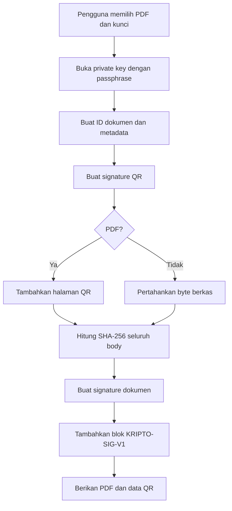
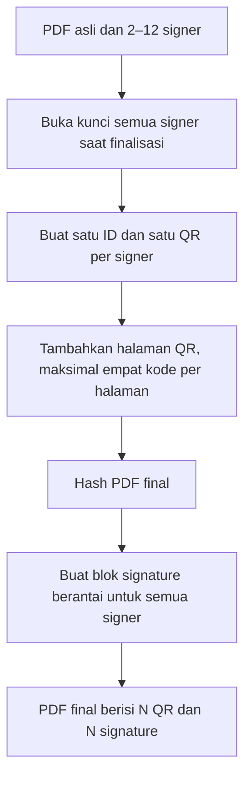
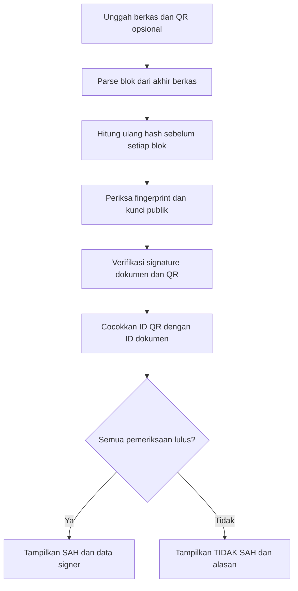

# APLIKASI TANDA TANGAN DIGITAL ECDSA P-256 DENGAN QR-CODE DAN MULTI-SIGNATURE

**Laporan Proyek Aplikasi Kriptografi dan Keamanan Informasi**  
**Topik D: Digital Signature**

| Keterangan | Isi |
|---|---|
| Nama aplikasi | Kripto Tanda Tangan / Siliwangi-Disign |
| Anggota | Ghea Ragil Aulia - 247006111003; Ristin Iman Andini - 247006111024 |
| Repositori | `<isi tautan GitHub final>` |
| Video demonstrasi | `<isi tautan video final>` |
| Berkas pengumpulan | `TugasKripto_D_<NPM-Ketua>.pdf` |

> **Catatan sumber.** Laporan ini disusun dari dokumentasi proyek, kode sumber, test suite, skrip benchmark, `data-uji/hasil/hasil.json`, grafik pada `laporan/gambar/`, dan screenshot yang tersedia. Nilai numerik Bab V mengikuti JSON hasil pengujian terbaru. Screenshot antarmuka belum tersedia sebagai berkas di workspace; lokasi penyisipannya diberi penanda agar pemilik dapat menempelkan gambar asli tanpa mengubah deskripsi faktualnya.

## ABSTRAK

Dokumen elektronik memerlukan mekanisme untuk mendeteksi perubahan isi dan mengaitkan dokumen dengan kunci penandatangan. Proyek ini menghasilkan aplikasi web tanda tangan digital bernama Kripto Tanda Tangan atau Siliwangi-Disign. Aplikasi menggunakan ECDSA pada kurva P-256, SHA-256 untuk hash dokumen, QR-Code untuk membawa metadata dan signature QR, serta penyimpanan private key yang disegel dengan AES-256-GCM menggunakan kunci hasil derivasi scrypt. Aplikasi menyediakan pembuatan kunci, penandatanganan PDF, verifikasi, dan penandatanganan beberapa signer. Finalisasi multi-signature mendukung 2–12 signer dan membuat satu QR-Code untuk setiap signer sebelum semua blok signature dibuat.

Data pengujian proyek mencatat ukuran signature ECDSA P-256 sebesar 64 byte, kunci publik raw 65 byte, blok signature 693 byte, dan payload QR 348 byte pada hasil benchmark yang tersimpan. Rata-rata sign ECDSA pesan pendek adalah 0,0575 ms dan verify 0,1139 ms. Pengujian juga mencatat penolakan terhadap perubahan dokumen, kunci publik yang salah, dan beberapa bentuk QR palsu. Hasil ini menunjukkan bahwa aplikasi dapat digunakan sebagai prototipe pembelajaran tanda tangan digital. Hubungan antara kunci dan identitas tetap bergantung pada daftar kunci terdaftar, bukan sertifikat atau otoritas identitas eksternal.

**Kata kunci:** tanda tangan digital, ECDSA P-256, SHA-256, QR-Code, integritas dokumen, multi-signature.

# BAB I PENDAHULUAN

## 1.1 Latar Belakang

Dokumen surat, sertifikat, dan lembar pengesahan semakin sering dibuat serta dibagikan dalam bentuk PDF. Gambar tanda tangan atau hasil pemindaian tanda tangan basah dapat disalin. Bentuk tersebut juga tidak memberikan bukti kriptografis bahwa isi dokumen masih sama setelah ditandatangani.

Tanda tangan digital memberikan cara untuk mengikat isi dokumen dengan kunci privat penandatangan. Kunci publik digunakan untuk memeriksa signature tersebut. Hash membuat perubahan pada byte dokumen dapat dideteksi. QR-Code dapat membantu membawa metadata penandatangan dan data yang dibutuhkan untuk pemeriksaan.

Proyek ini menggabungkan ECDSA P-256, SHA-256, QR-Code, serta brankas kunci terenkripsi. Aplikasi juga menyediakan alur multi-signature. Pengguna mengumpulkan 2–12 signer, lalu aplikasi membentuk halaman QR dari PDF asli sebelum membuat signature berantai semua signer.

## 1.2 Identifikasi Masalah

1. Bagaimana membuat signature yang mendeteksi perubahan isi dokumen?
2. Bagaimana menyimpan private key tanpa menulisnya sebagai teks biasa?
3. Bagaimana mengikat metadata signer dan ID dokumen pada QR-Code?
4. Bagaimana menolak kunci publik yang salah dan QR-Code yang diubah?
5. Bagaimana membentuk PDF multi-signature dengan satu QR-Code untuk setiap signer?
6. Bagaimana mengukur waktu, ukuran, dan hasil pengujian yang tersedia?

## 1.3 Tujuan

1. Membuat aplikasi web tanda tangan digital berbasis ECDSA P-256 dan SHA-256.
2. Menyimpan private key dalam bentuk terenkripsi dengan scrypt dan AES-256-GCM.
3. Menambahkan QR-Code berisi metadata dan signature QR pada halaman pengesahan PDF.
4. Menyediakan verifikasi signature, hash, QR-Code, fingerprint, dan status kunci terdaftar.
5. Mendukung finalisasi 2–12 signer dengan satu QR-Code per signer dan halaman pengesahan dinamis.
6. Menyajikan hasil pengujian berdasarkan data yang disimpan dalam proyek.

## 1.4 Batasan

1. Algoritma signature yang digunakan adalah ECDSA P-256 dengan SHA-256.
2. Aplikasi dan laporan ini merupakan prototipe akademik.
3. Kepercayaan terhadap identitas signer berasal dari fingerprint kunci yang terdaftar di vault.
4. Tidak ada klaim bahwa aplikasi telah menggunakan sertifikat digital atau otoritas sertifikasi.
5. Pemindaian QR-Code dengan kamera ponsel belum memiliki bukti hasil dalam artefak proyek.
6. Angka benchmark dapat berubah pada perangkat atau pelaksanaan yang berbeda.
7. Referensi jurnal harus tetap diperiksa pemilik melalui Google Scholar dan Mendeley sebelum pengumpulan.

# BAB II DASAR TEORI

## 2.1 Tanda Tangan Digital

Tanda tangan digital menggunakan pasangan kunci privat dan kunci publik. Kunci privat digunakan untuk menghasilkan signature. Kunci publik digunakan untuk memeriksa signature. Pemeriksaan yang berhasil menunjukkan bahwa pesan yang diperiksa sesuai dengan pesan yang ditandatangani dan signature berhubungan dengan kunci publik tersebut.

Dalam aplikasi, pesan signature tidak hanya berupa isi dokumen. Pesan juga memuat hash dokumen, ID dokumen, fingerprint, metadata signer, dan signature QR. Dengan demikian, perubahan pada salah satu komponen pesan dapat menyebabkan pemeriksaan gagal.

Tanda tangan digital tidak otomatis membuktikan identitas dunia nyata. Aplikasi menggunakan daftar kunci terdaftar sebagai sumber kepercayaan lokal. Jika fingerprint tidak ditemukan, signature masih dapat sah secara matematis, tetapi signer dilaporkan tidak terdaftar.

## 2.2 Fungsi Hash SHA-256

SHA-256 mengubah pesan dengan panjang bebas menjadi digest 256 bit atau 32 byte. Secara konseptual:

$$H = SHA\text{-}256(M)$$

Dengan $M$ adalah byte yang dilindungi dan $H$ adalah digest. Aplikasi menyimpan hash heksadesimal pada field `h` dalam blok signature. Saat verifikasi, aplikasi menghitung kembali hash byte sebelum lokasi blok. Perbedaan hash menyebabkan blok tidak valid.

## 2.3 ECDSA P-256

ECDSA adalah algoritma signature berbasis kurva eliptik. Implementasi menggunakan kurva `prime256v1`, yang dikenal sebagai NIST P-256. Signature aplikasi memakai format raw IEEE P1363, yaitu konkatenasi dua komponen:

$$signature = r \mathbin{\|} s$$

Setiap komponen memiliki panjang 32 byte sehingga:

$$|signature| = 32 + 32 = 64\ byte$$

Alur konseptual sign dan verify adalah:

$$m \rightarrow SHA\text{-}256(m) \rightarrow Sign_{k_{priv}}(m) \rightarrow (r,s)$$

$$Verify_{k_{pub}}(m,r,s) \rightarrow \{true,false\}$$

Ukuran signature yang tetap menjadi alasan praktis penggunaan ECDSA pada aplikasi yang juga membawa data melalui QR-Code.

## 2.4 Perlindungan Private Key

Private key diekspor sebagai PKCS#8 DER, kemudian disegel dengan AES-256-GCM. Kunci AES berasal dari passphrase melalui scrypt. Bentuk konseptualnya:

$$K = scrypt(passphrase, salt, 32\ byte)$$

$$C,tag = AES\text{-}256\text{-}GCM\_Encrypt(K, nonce, privateKey, AAD)$$

Salt dan nonce dibuat acak. Fingerprint kunci publik digunakan sebagai data autentikasi tambahan. Ketika passphrase, ciphertext, tag, atau fingerprint tidak sesuai, private key tidak dapat dibuka.

## 2.5 QR-Code

QR-Code adalah kode dua dimensi untuk membawa teks. Aplikasi menghasilkan QR dengan koreksi kesalahan level M. Payload hasil JSON memuat nama signer, jabatan, institusi, timestamp, ID dokumen, fingerprint kunci publik, dan signature QR.

Pesan yang ditandatangani untuk QR berbentuk:

`KRIPTO-QR1|<id>|<fingerprint>|[<nama>,<jabatan>,<institusi>,<waktu>]`

QR-Code tidak menggantikan signature dokumen. Signature QR mengikat metadata QR dengan kunci signer. Hash dan signature dokumen tetap digunakan untuk memeriksa keutuhan berkas.

## 2.6 Signature Berantai dan Multi-Signature

Pada signature berantai, blok setiap signer merujuk pada seluruh byte sebelum blok tersebut. Pada finalisasi multi-signature, semua QR dibuat terlebih dahulu dari PDF asli, kemudian signature dokumen dibuat berurutan atas PDF final dan blok sebelumnya.

Halaman pengesahan menempatkan maksimal empat QR per halaman dan menambahkan halaman berikutnya bila signer lebih banyak. Cara ini memastikan setiap signer memiliki QR dan semua signer menandatangani byte PDF final yang sama.

# BAB III RANCANGAN SISTEM

## 3.1 Arsitektur Sistem

Aplikasi menggunakan Next.js dan TypeScript. Lapisan antarmuka berada pada `src/app/`. Logika kriptografi dan signature berada pada `src/lib/sig/`. API berada pada route handler di `src/app/api/`.

| Komponen | Peran |
|---|---|
| `keys.ts` | Membuat pasangan kunci, sign, verify, fingerprint, seal, dan open private key |
| `keystore.ts` | Mengelola kunci lokal dan metadata signer |
| `blob-keystore.ts` | Menyediakan penyimpanan berbasis Vercel Blob ketika token dikonfigurasi |
| `format.ts` | Membentuk pesan, blok, encoding, dan parsing blok |
| `service.ts` | Mengatur sign, verify, co-sign, dan finalisasi 2–12 signer |
| `qr.ts` | Membuat, membaca, dan memeriksa QR payload |
| `pdfstamp.ts` | Membuat halaman pengesahan PDF dan menempatkan QR dinamis, maksimal empat per halaman |
| `api/keys` | Endpoint pembuatan dan daftar kunci |
| `api/sign` | Endpoint penandatanganan |
| `api/verify` | Endpoint verifikasi |
| `multi-sign/page.tsx` | Antarmuka penandatanganan berurutan |
| `uji-ketahanan/page.tsx` | Antarmuka pengujian wajib |

## 3.2 Struktur Blok Signature

Blok signature diletakkan setelah byte berkas dan diawali marker:

`%KRIPTO-SIG-V1 `

Isi blok berupa JSON kanonik yang dikodekan dengan base64url. Field utamanya adalah:

| Field | Makna |
|---|---|
| `v` | Versi format |
| `id` | ID dokumen |
| `alg` | Algoritma, yaitu `ES256` |
| `h` | SHA-256 byte sebelum blok |
| `n`, `t`, `o`, `d` | Nama, jabatan, institusi, dan waktu |
| `pk` | Kunci publik raw dalam base64url |
| `sig` | Signature dokumen |
| `qs` | Signature pesan QR |

JSON kanonik dan base64url digunakan untuk mencegah variasi encoding yang tidak terdeteksi. Parser membaca blok dari akhir berkas dan mengembalikannya dalam urutan penandatanganan.

## 3.3 Diagram Alur Sign Tunggal


```mermaid
flowchart TD
    A[Pengguna memilih PDF dan kunci] --> B[Buka private key dengan passphrase]
    B --> C[Buat ID dokumen dan metadata]
    C --> D[Buat signature QR]
    D --> E{PDF?}
    E -- Ya --> F[Tambahkan halaman QR]
    E -- Tidak --> G[Pertahankan byte berkas]
    F --> H[Hitung SHA-256 seluruh body]
    G --> H
    H --> I[Buat signature dokumen]
    I --> J[Tambahkan blok KRIPTO-SIG-V1]
    J --> K[Berikan PDF dan data QR]
```

## 3.4 Diagram Alur Finalisasi QR Dinamis


```mermaid
flowchart TD
    A[PDF asli dan 2–12 signer] --> B[Buka kunci semua signer saat finalisasi]
    B --> C[Buat satu ID dan satu QR per signer]
    C --> D[Tambahkan halaman QR, maksimal empat kode per halaman]
    D --> E[Hash PDF final]
    E --> F[Buat blok signature berantai untuk semua signer]
    F --> G[PDF final berisi N QR dan N signature]
```

## 3.5 Diagram Alur Verifikasi


```mermaid
flowchart TD
    A[Unggah berkas dan QR opsional] --> B[Parse blok dari akhir berkas]
    B --> C[Hitung ulang hash sebelum setiap blok]
    C --> D[Periksa fingerprint dan kunci publik]
    D --> E[Verifikasi signature dokumen dan QR]
    E --> F[Cocokkan ID QR dengan ID dokumen]
    F --> G{Semua pemeriksaan lulus?}
    G -- Ya --> H[Tampilkan SAH dan data signer]
    G -- Tidak --> I[Tampilkan TIDAK SAH dan alasan]
```

## 3.6 Rancangan Antarmuka

Antarmuka utama memiliki area pembuatan kunci, penandatanganan, dan verifikasi. Halaman multi-signature menyediakan dokumen berantai, pilihan signer, passphrase, urutan signer, dan hasil terbaru. Halaman uji ketahanan menyediakan PDF asli, kata sandi kunci benar, kunci benar, dan kunci salah.

### Gambar 1. Halaman Uji Ketahanan Dokumen

**[SISIPKAN screenshot asli yang dikirimkan pemilik di sini]**

Screenshot yang tersedia memperlihatkan halaman lokal `/uji-ketahanan`. Bagian yang terlihat adalah kartu **INPUT PENGUJIAN**, judul **Jalankan pengujian wajib**, pemilih **PDF asli**, field **Kata sandi kunci benar**, pilihan **Kunci benar** bernama `ristin`, pilihan **Kunci salah** bernama `gea`, tombol **Jalankan semua pengujian**, serta pesan error `this key has already signed the document`. Pesan tersebut menunjukkan bahwa file yang dipilih telah memiliki signature dari kunci yang digunakan; screenshot tidak digunakan untuk menyimpulkan keberhasilan pengujian.

### Gambar 2. Halaman Pengesahan PDF Multi-Signature

**[SISIPKAN screenshot PDF hasil finalisasi multi-signer di sini]**

Gambar ini hanya boleh diisi setelah pemilik mengambil screenshot PDF hasil terbaru. Tampilkan jumlah halaman pengesahan yang diperlukan dan QR-Code yang jumlahnya sama dengan signer pada PDF tersebut.

# BAB IV IMPLEMENTASI

## 4.1 Pembangkitan dan Penyimpanan Kunci

`generateKeyPair()` membuat pasangan kunci pada kurva `prime256v1`. Kunci publik raw disimpan sebagai titik tidak terkompresi sepanjang 65 byte. Fingerprint dihitung dari hash SHA-256 kunci publik dan digunakan untuk membedakan kunci.

`sealPrivateKey()` mengekspor private key dalam format PKCS#8 DER. Fungsi tersebut menurunkan kunci dari passphrase dengan scrypt dan mengenkripsi private key menggunakan AES-256-GCM. `openPrivateKey()` hanya mengembalikan private key jika pemeriksaan autentikasi berhasil.

Pada deployment yang memiliki `BLOB_READ_WRITE_TOKEN`, `vault.ts` memilih `BlobKeystore`. Pada lingkungan tanpa token tersebut, aplikasi menggunakan penyimpanan lokal. Nilai token tidak ditulis pada laporan atau kode sumber.

## 4.2 Pesan dan Blok Signature

`format.ts` membangun `qrMessage()` dan `docMessage()`. Pesan dokumen memasukkan `qs`, yaitu signature QR. Keputusan tersebut membuat perubahan pada signature QR ikut dilindungi oleh signature dokumen.

`encodeBlock()` menggunakan struktur JSON kanonik. `parseBlocks()` membaca marker dan base64url dari akhir berkas. Parser menolak JSON yang tidak kanonik, panjang signature yang salah, dan field yang tidak sesuai pola.

## 4.3 Pembuatan QR-Code

`qrText()` membuat payload JSON dengan field signer, timestamp, ID dokumen, fingerprint, dan signature. `qrPng()` membuat gambar QR dengan koreksi kesalahan level M. `parseQr()` memeriksa struktur dan panjang field. `verifyQr()` memeriksa signature QR menggunakan kunci publik yang fingerprint-nya sesuai.

## 4.4 Pembuatan Halaman PDF

`addQrPage()` menggunakan `pdf-lib` untuk menambahkan satu halaman QR pada sign tunggal. `addQrPages()` menangani finalisasi multi-signature: fungsi membuat halaman pengesahan dengan maksimal empat QR per halaman, lalu menambahkan halaman berikutnya jika jumlah signer lebih banyak. Setiap QR menampilkan metadata signer terkait.

## 4.5 Finalisasi Multi-Signature

`signDocumentChain()` menerima PDF asli dan 2 sampai 12 objek signer. Fungsi ini membuat satu ID dokumen dan satu signature QR untuk tiap signer, menambahkan halaman QR dari PDF asli, lalu membuat blok signature berantai untuk semua signer. Semua QR dibuat sebelum hash PDF dihitung agar perubahan halaman QR tidak membatalkan signature sebelumnya.

Pada route `api/sign`, finalisasi menerima daftar signer, file `.dsk`, dan passphrase per signer dalam satu request. Antarmuka `/multi-sign` menahan file dan passphrase hanya pada state halaman, kemudian mengirimkannya sekali saat finalisasi. Data staged tidak ditulis ke local storage, session storage, atau penyimpanan server; memuat ulang halaman akan menghapus draft. Setelah body PDF lengkap, API membuat satu blok signature untuk setiap signer.

## 4.6 Verifikasi

`verifyDocument()` melakukan pemeriksaan berikut:

1. membaca blok dari akhir berkas;
2. menghitung ulang hash byte sebelum setiap blok;
3. memeriksa kunci publik dan fingerprint;
4. memeriksa signature dokumen;
5. memeriksa signature QR yang tersimpan pada blok;
6. membandingkan ID QR dengan ID dokumen;
7. melaporkan status kunci terdaftar jika registry tersedia.

## 4.7 Potongan Kode Penting

Potongan berikut memperlihatkan konsep pesan dokumen yang juga melindungi signature QR:

```ts
export const docMessage = (
  hashHex: string,
  id: string,
  fp: string,
  meta: Meta,
  qs: string,
): string =>
  `KRIPTO-DOC1|${hashHex}|${id}|${fp}|${metaJson(meta)}|${qs}`;
```

Potongan berikut memperlihatkan prinsip hash pada setiap blok:

```ts
const h = sha256hex(body);
const sig = signMessage(
  signer.privateKey,
  docMessage(h, docId, fp, meta, b64u(qs)),
);
```

# BAB V PENGUJIAN DAN ANALISIS

## 5.1 Sumber Data Pengujian

Angka pada bab ini berasal dari `data-uji/hasil/hasil.json`. Skrip benchmark menyatakan bahwa pengukuran menggunakan Node dan menghasilkan pengulangan berbeda sesuai jenis operasi. Uji sign dan verify pesan pendek menggunakan 200 pengulangan. Uji PDF menggunakan 30 pengulangan per ukuran. Uji scrypt menggunakan 30 pengulangan.

Karena JSON tidak menyimpan nama komputer atau tanggal eksekusi secara lengkap, laporan ini tidak menambahkan klaim perangkat atau sistem operasi. Nilai waktu dibaca sebagai hasil satu eksekusi benchmark yang tersimpan.

## 5.2 Pembangkitan dan Perlindungan Kunci

| Operasi | Ulangan | Rerata (ms) | Simpangan baku (ms) |
|---|---:|---:|---:|
| Pembangkitan pasangan kunci ECDSA P-256 | 100 | 0,0661 | 0,1053 |
| Penyegelan private key dengan scrypt dan AES-256-GCM | 30 | 93,4608 | 8,2538 |
| Pembukaan private key | 30 | 86,2643 | 1,4538 |

Pembangkitan kunci membutuhkan waktu rata-rata paling kecil. Penyegelan dan pembukaan lebih mahal karena melibatkan scrypt dan operasi enkripsi terautentikasi. Perbedaan rerata seal dan open tidak digunakan untuk menyimpulkan keamanan yang lebih tinggi pada salah satu operasi.

## 5.3 Ukuran Data

| Objek | Ukuran | Keterangan |
|---|---:|---|
| Signature ECDSA P-256 raw `r||s` | 64 byte | Format yang digunakan |
| Signature DER | 71 byte | Pembanding pada sampel benchmark |
| Kunci publik raw | 65 byte | Titik tidak terkompresi `0x04 || x || y` |
| Kunci publik SPKI DER | 91 byte | Hasil ekspor pembanding |
| Kunci publik PEM | 178 karakter | Hasil ekspor pembanding |
| Satu blok signature | 693 byte | Metadata, hash, kunci publik, dan dua signature |
| Payload QR-Code | 348 byte | Versi 14, 73 x 73 modul, koreksi M |
| PDF asli tiga halaman | 7.205 byte | Sebelum stamp dan blok signature |
| PDF setelah halaman QR dan satu blok | 23.725 byte | Tambahan 16.520 byte |

Ukuran signature dan kunci publik bersifat tetap pada format yang diuji. Ukuran PDF meningkat terutama karena halaman pengesahan dan gambar QR, bukan karena 64 byte signature ECDSA saja.

### Gambar 3. Perbandingan ukuran objek kriptografi dan dokumen

**[SISIPKAN `laporan/gambar/ukuran.png`]**

Grafik harus ditempel dari file PNG yang tersedia. Caption tidak menyatakan nilai tambahan selain tabel karena ukuran yang digunakan sudah tercantum pada JSON.

## 5.4 Waktu Sign dan Verify

### 5.4.1 Operasi ECDSA

| Operasi | Ulangan | Rerata (ms) | Simpangan baku (ms) | Minimum (ms) | Maksimum (ms) |
|---|---:|---:|---:|---:|---:|
| ECDSA sign pesan pendek | 200 | 0,0575 | 0,0342 | 0,0409 | 0,3738 |
| ECDSA verify pesan pendek | 200 | 0,1139 | 0,0339 | 0,0821 | 0,2330 |

### 5.4.2 Berkas biner berdasarkan ukuran

| Ukuran | SHA-256 saja (ms) | Sign lengkap (ms) | SD sign (ms) | Verify lengkap (ms) | SD verify (ms) | Ulangan sign |
|---|---:|---:|---:|---:|---:|---:|
| 1 KB | 0,0067 | 31,1409 | 1,4662 | 0,4117 | 0,1344 | 40 |
| 100 KB | 0,2322 | 34,4761 | 8,4333 | 0,5882 | 0,1627 | 40 |
| 1 MB | 2,4234 | 36,0842 | 2,6726 | 2,8186 | 0,3276 | 40 |
| 10 MB | 23,9594 | 62,6141 | 4,8206 | 25,2033 | 0,9118 | 30 |

Sign lengkap mencakup pembuatan signature dan pembentukan blok. Waktu SHA-256 meningkat saat ukuran input meningkat. Verify lengkap juga meningkat, karena harus membaca dan melakukan hash terhadap data yang lebih besar.

### 5.4.3 PDF

| Dokumen | Sign lengkap (ms) | SD sign (ms) | Verify lengkap (ms) | SD verify (ms) |
|---|---:|---:|---:|---:|
| PDF 1 halaman, 2.975 byte | 90,1090 | 21,2104 | 0,7563 | 0,3835 |
| PDF 5 halaman, 11.434 byte | 125,9966 | 46,4953 | 0,7401 | 0,1208 |
| PDF 20 halaman, 43.181 byte | 95,2596 | 12,1037 | 0,6124 | 0,2263 |

Nilai PDF pada JSON tersimpan dalam urutan `[label, rerata sign, SD sign, rerata verify, SD verify]`. Waktu sign mencakup pembuatan QR dan halaman pengesahan, sedangkan verify memeriksa signature dan hash dari file yang sudah ditandatangani.

### Gambar 4. Waktu pengolahan PDF

**[SISIPKAN `laporan/gambar/waktu-pdf.png`]**

### Gambar 5. Waktu pengolahan berdasarkan ukuran berkas

**[SISIPKAN `laporan/gambar/waktu-ukuran.png`]**

## 5.5 Uji Tamper

| Dokumen | Ukuran file bertanda tangan | Perubahan | Hasil |
|---|---:|---|---|
| PDF 3 halaman | 23.889 byte | 1 byte isi dokumen diubah | ditolak |

Hasil JSON menyimpan satu skenario tamper benchmark. Test suite juga memiliki pengujian yang membalik byte pada file bertanda tangan dan memeriksa bahwa perubahan menyebabkan hasil tidak valid. Jumlah total percobaan tamper dari laporan draf lama tidak digunakan di sini karena tidak tersimpan dalam JSON benchmark terbaru.

## 5.6 Uji Kunci Publik yang Salah

| Skenario | Hasil |
|---|---|
| Kunci publik yang salah | ditolak |
| Kunci publik yang benar | diterima |

Uji ini menunjukkan bahwa signature tidak dapat diverifikasi menggunakan kunci publik yang tidak berpasangan. Nama signer yang sama juga tidak cukup untuk menggantikan fingerprint kunci.

## 5.7 Uji QR-Code Palsu

| Skenario | Hasil |
|---|---|
| Nama diubah | ditolak |
| Jabatan diubah | ditolak |
| Institusi diubah | ditolak |
| Waktu diubah | ditolak |
| ID dokumen diubah | ditolak |
| Fingerprint diubah | ditolak |
| Signature pada QR diubah | ditolak |
| QR asli | diterima |

QR yang sah tidak berdiri sendiri sebagai bukti keutuhan isi file. Aplikasi juga memeriksa ID dokumen dan signature dokumen.

## 5.8 Uji Multi-Signature

Test suite memeriksa alur lama yang menandatangani berurutan serta alur finalisasi baru dengan 2 sampai 6 signer. Pada alur finalisasi, test memeriksa jumlah QR sesuai jumlah signer, setiap QR valid terhadap PDF final, semua blok signature valid, dan halaman pengesahan bertambah satu untuk setiap kelompok maksimal empat QR. Test juga menolak jumlah signer di luar 2–12 dan pemakaian kunci yang sama dua kali.

Pada finalisasi, semua QR-Code ditempatkan pada PDF sebelum signature dokumen dibuat. File `.dsk` dan passphrase berada sementara di memori halaman dan dikirim bersama pada request finalisasi; keduanya tidak disimpan secara permanen oleh aplikasi.

### Gambar 6. Waktu verifikasi terhadap jumlah signer

**[SISIPKAN `laporan/gambar/multi-waktu.png` jika data multi-signer tersedia pada sumber yang sama]**

### Gambar 7. Ukuran file terhadap jumlah signer

**[SISIPKAN `laporan/gambar/multi-ukuran.png` jika data multi-signer tersedia pada sumber yang sama]**

## 5.9 Analisis Keterbatasan Pengujian

1. JSON benchmark terbaru tidak menyimpan semua angka multi-signer yang pernah ditulis pada draf lama.
2. Angka benchmark tetap perlu dicocokkan dengan XLSX sebelum laporan final diekspor.
3. Screenshot antarmuka belum tersimpan sebagai file di workspace.
4. Pemindaian QR dengan kamera ponsel belum memiliki bukti hasil.
5. Referensi jurnal harus diperiksa kembali melalui Google Scholar dan Mendeley oleh pemilik.
6. Peringatan kompatibilitas PDF pada pembaca tertentu perlu diuji pada perangkat lunak PDF yang ditargetkan.

# BAB VI KESIMPULAN DAN SARAN

## 6.1 Kesimpulan

Aplikasi Kripto Tanda Tangan menerapkan signature digital berbasis ECDSA P-256 dengan SHA-256. Aplikasi menyediakan pembuatan kunci, penyegelan private key, penandatanganan PDF, QR-Code, verifikasi, dan multi-signature. Finalisasi mendukung 2 sampai 12 signer, dengan satu QR-Code untuk setiap signer. Halaman pengesahan menampung maksimal empat QR; signer tambahan mendapat halaman berikutnya sebelum seluruh blok signature dibuat.

Berdasarkan hasil JSON yang tersedia, signature raw berukuran 64 byte, kunci publik raw 65 byte, blok signature 693 byte, dan payload QR 348 byte. Rata-rata operasi ECDSA pesan pendek adalah 0,0575 ms untuk sign dan 0,1139 ms untuk verify. Skenario tamper, kunci publik salah, dan QR palsu yang tercatat menghasilkan penolakan sesuai harapan.

Namun, aplikasi masih merupakan prototipe akademik. Validitas matematis signature tidak sama dengan pembuktian identitas dunia nyata. Sistem juga belum memiliki sertifikat, pencabutan kunci, timestamp tepercaya, atau bukti pemindaian ponsel dalam artefak laporan.

## 6.2 Saran Pengembangan

1. Menambahkan sertifikat digital atau mekanisme trust registry yang lebih kuat.
2. Menambahkan pencabutan dan rotasi kunci.
3. Menambahkan timestamp tepercaya.
4. Mengadopsi format signature PDF standar seperti PAdES.
5. Menambahkan pengujian pada beberapa pembaca PDF.
6. Mendokumentasikan pemindaian QR dengan kamera ponsel.
7. Menyimpan hasil benchmark final yang lengkap dan konsisten antara JSON dan XLSX.
8. Memeriksa seluruh referensi melalui Google Scholar dan Mendeley sebelum pengumpulan.
9. Menambahkan pengujian algoritma signature pasca-kuantum sebagai penelitian lanjutan, bukan sebagai fitur yang sudah ada.

# DAFTAR REFERENSI

> Metadata DOI pada entri berikut dicocokkan dengan metadata DOI publik. Pemilik tetap wajib mencocokkan metadata dan keberadaan publikasi melalui Google Scholar serta Mendeley, terutama untuk memenuhi ketentuan dosen dan memastikan minimal tiga jurnal berbahasa Indonesia. Entri yang belum memiliki metadata lengkap tidak dipaksakan masuk daftar.

1. Gunawan, R., Rahmatulloh, A., & Rizal, R. (2024). Implementasi digital signature pada dokumen elektronik berbasis QR-Code. *STRING (Satuan Tulisan Riset dan Inovasi Teknologi), 9*(2). https://doi.org/10.30998/string.v9i2.21407
2. Ajif, A. M., Nuraeni, F., Kurniadi, D., & Elsen, R. (2025). Implementasi modul tanda tangan digital dengan superenkripsi RSA-ECDSA dan SHA-512 pada sistem informasi akademik sekolah. *Jurnal Algoritma, 22*(2). https://doi.org/10.33364/algoritma/v.22-2.2353
3. Ismail, A., Hadid, V. A. F., & Taufika, A. F. (2023). Digital signature system using SHA-3 and ECDSA. *UNISTEK, 10*(2). https://doi.org/10.33592/unistek.v10i2.3538
4. Situmorang, M., Dewantoro, R. W., Saragih, W. A., & Panjaitan, P. T. (2026). Penerapan Elliptic Curve Digital Signature Algorithm (ECDSA) dalam blockchain untuk sistem pembayaran digital Indonesia. *Dinamik, 31*(1). https://doi.org/10.35315/dinamik.v31i1.10329
5. Wellem, T., Nataliani, Y., & Iriani, A. (2022). Academic document authentication using elliptic curve digital signature algorithm and QR code. *JOIV: International Journal on Informatics Visualization, 6*(3), 667. https://doi.org/10.30630/joiv.6.2.872
6. Tan, P. H. P., Rizky, A., Aini, Q., Ramadhan, D. N., & Green, T. (2025). Utilizing the AlphaSign website to create blockchain-based or online digital signatures. *Blockchain Frontier Technology, 5*(1). https://doi.org/10.34306/bfront.v5i1.785
7. Fitriani, N. A., Aminuddin, & Arifianto, S. (2024). Perbandingan kinerja algoritma Elliptic Curve Digital Signature Algorithm (ECDSA) menggunakan fungsi hash Secure Hash Algorithm (SHA-1) dan Keccak pada tanda tangan digital. *Jurnal Repositor, 3*(3). https://doi.org/10.22219/repositor.v3i3.31071
8. National Institute of Standards and Technology. (2023). *Digital signature standard (DSS)* (FIPS PUB 186-5). https://doi.org/10.6028/NIST.FIPS.186-5
9. National Institute of Standards and Technology. (2015). *Secure hash standard (SHS)* (FIPS PUB 180-4). https://doi.org/10.6028/NIST.FIPS.180-4
10. Percival, C., & Josefsson, S. (2016). *The scrypt password-based key derivation function* (RFC 7914). Internet Engineering Task Force. https://www.rfc-editor.org/rfc/rfc7914
11. Dworkin, M. (2007). *Recommendation for block cipher modes of operation: Galois/Counter Mode (GCM) and GMAC* (NIST SP 800-38D). National Institute of Standards and Technology. https://doi.org/10.6028/NIST.SP.800-38D
12. International Organization for Standardization. (2015). *Information technology - Automatic identification and data capture techniques - QR Code bar code symbology specification* (ISO/IEC 18004:2015). https://www.iso.org/standard/62021.html

# LAMPIRAN A. PENGGUNAAN ASISTEN AI

Dokumentasi proyek menyebutkan penggunaan Claude Code untuk membantu rancangan format signature, draf kode, route API, UI, test unit, benchmark, grafik, review keamanan, dan kerangka laporan. Anggota tetap bertanggung jawab memahami kode, memeriksa angka, menguji aplikasi, memeriksa referensi, menyediakan screenshot, dan mempresentasikan hasil.

Nama anggota yang memverifikasi setiap bagian dan daftar pekerjaan mandiri masih harus diisi pada `laporan/lampiran-penggunaan-ai.md`.

# LAMPIRAN B. DAFTAR PERIKSA SEBELUM PENGUMPULAN

- [ ] Tautan repositori final dan video demo diisi.
- [ ] Screenshot asli antarmuka dan PDF multi-QR ditempel.
- [ ] Gambar PNG hasil benchmark ditempel dan nomor caption konsisten.
- [ ] Nilai SD verify PDF diambil dari XLSX dan menggantikan penanda yang belum tersedia.
- [ ] Referensi diimpor dan diverifikasi melalui Google Scholar serta Mendeley.
- [ ] Minimal 7 referensi jurnal dan minimal 3 jurnal berbahasa Indonesia dipastikan relevan.
- [ ] Publikasi dosen pengampu yang relevan dikonfirmasi dengan identitas dosen dan metadata asli.
- [ ] Nomor anggota, tanggal, dan tautan pengumpulan dilengkapi.
- [ ] Tidak ada private key, passphrase, token, atau data pribadi sensitif di laporan dan repositori.
- [ ] `npm test`, `npx tsc --noEmit`, dan `npm run build` dijalankan sebelum ekspor PDF.
